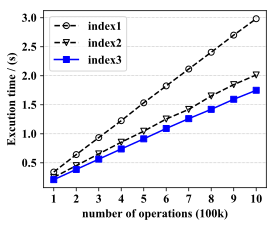
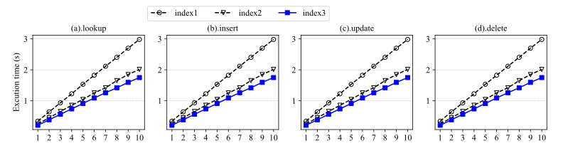

## Drawing in Science Paper Writing

#### Draw a single line figure

Using  python script `line.py` to draw a figure, which contains a single line figure of several competitors. Among them, the blue line is emphasized. 

##### Usage:

Specify the data filename, x axis label, y axis label, the x ticks labels and a list of the competitor names to generate the figure suits you mostly. 

Note that the data file should contains several lines, each line contains equal number of values.  For example, a data file contains four groups of data from three competitors: (The last value is to be emphasized)

```
0.3408395   0.2495335   0.21012175
0.6419555   0.45163225  0.386052
0.934215    0.6537715   0.563327
1.22568 0.85500975  0.7388075
1.533655    1.04446 0.91288175
1.825165    1.25456 1.09168
2.1157275   1.42025 1.261415
2.405055    1.6517225   1.4211525
2.699995    1.8469475   1.5947675
2.98255 2.0136675   1.749825
```

using function `plotlines()` in `line.py` to draw a sample line figure:

```python
plotlines('lookup.txt', # file name
        'number of operations (100k)', # x label
        'Excution time / (s)',         # y label
        ['1', '2', '3', '4', '5', '6', '7', '8', '9', '10'], # xticks label is customized
        ["index1", "index2", "index3"], # competitor names
        1 # a optional parameter for scaling the data to some unit, 1 in default 
)
```

This configuration draws a line figure in the following way. A svg format vector illustration figure is generated along with a png format figure.




#### Draw a figure contains multi sub- line figures

using the python script `lines.py` to draw a figure contains several sub figures and sharing the same legend or something.

The `plotlines()` function has some new arguments: 

```python
plotlines(
['lookup.txt', 'lookup.txt', 'lookup.txt', 'lookup.txt'], # sub data file names
'number of operations (100k)',
'Excution time (s)', 
['1', '2', '3', '4', '5', '6', '7', '8', '9', '10'],
["index1", "index2", "index3"],
["(a).lookup", "(b).insert", "(c).update", "(d).delete"], # sub figure title
 1
)
```

the result of it looks like this: 


#### Draw a single bar figure

In `bar.py`, basically the same as `line.py`

#### Draw a figure contains multi sub- bar figures

In `bars.py`, basically the same as `lines.py`